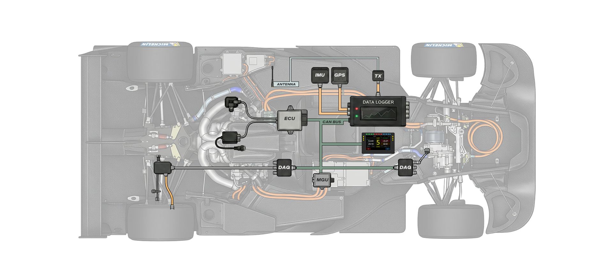
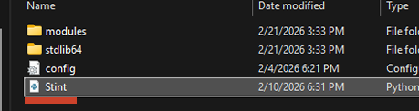
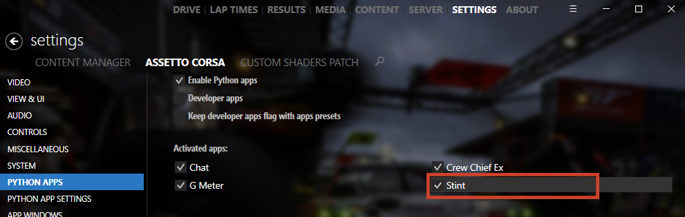
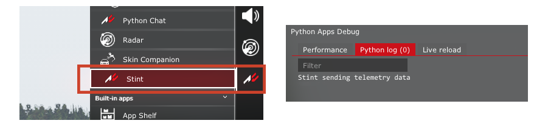
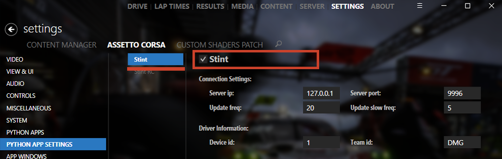

# AC Stint Data Logger

Stint es una Python app para Assetto Corsa destinada a enviar datos de telemetría en tiempo real vía UDP socket simulando una unidad data logger en circuito.

Dentro del simulador actúa como un data logger virtual; se encarga de recopilar, sincronizar y enviar datos del vehículo en tiempo real, tales como: RPMs, fuerzas G, ángulos de inclinación, recorrido de suspensión, temperatura y presión de neumáticos, posición GPS, entre otros.

**Nota**: La app está destinada a enviar los datos a un servidor. Más información en [ac-stint-race-data-server](https://github.com/fabetabilo/ac-stint-race-data-server.git)

### Requisitos

- Assetto Corsa
- Content Manager
- CSP Custom Shaders Patch (Versión estable)

## Features

Stint captura la telemetría del vehículo, empaqueta los paquetes de datos en binario con un header identificador y los envía vía UDP a un servidor. Permitiendo al servidor receptor procesar y sincronizar los datos correctamente para un unidad específica.

Datos de telemetría que envía:

- **Información del coche** - Información estática, daño y estado
- **Inputs del Piloto** - RPM, velocidad, marcha, throttle, freno, embrague, volante y combustible
- **IMU** - Aceleración (G-force), roll, pitch, yaw rate y altura del centro de gravedad (CoG)
- **Suspensión** - Recorrido, camber, carga en ruedas, velocidad angular y altura de marcha
- **Tiempos en Pista** - Posición, tiempos de vuelta/sector, bandera y estado de pit lane
- **GPS** - Posición mundial y dirección del vehículo
- **Neumáticos** - Temperatura, presión, suciedad, desgaste y deslizamiento
- **Aerodinámica** - Drag, downforce y coeficientes aerodinámicos

Información técnica de envío de datos → [Documento](docs/packets.md)

Algunos datos enviados como coeficientes aerodinámicos o slip, no los emite un data logger real directamente, pero son útiles para su análisis y comparación.

## Instalación y configuración

Descargar último asset release desde https://github.com/fabetabilo/ac-stint-telemetry-datalogger/releases/latest y descomprimir en la ruta de Assetto Corsa:
- `C:/Users/tu-usuario/Steam/steamapps/common/assettocorsa/apps/python/`

Dentro de la carpeta `apps/python/`, la carpeta de la app Stint **debe** llamarse "`Stint`". Deberías quedar con una estructura similar a:

Dentro de la carpeta de la app, el archivo `Stint.py` **debe** llamarse igual que la carpeta que contiene los archivos de la app `Stint`. Como referencia, el archivo y la carpeta de la app deberían estar en la ruta:

- `C:/Users/tu-usuario/Steam/steamapps/common/assettocorsa/apps/python/Stint/Stint.py`

#### En Content Manager
Dirígete a: `Settings` → `Assetto Corsa` → `Python Apps`

Asegúrate de tener marcadas las casillas:
- `Enable Python Apps`
- `Stint`

**Nota**: Puedes desactivar la app desde aquí en cualquier momento

Si todo está ok, dentro en Assetto Corsa debería aparecer el ícono de la app Python `Stint`. Puedes revisar con Python Apps Debug → Python log.
Esto indica que la app está enviando datos y funcionando correctamente.

## Configuración de comunicación

Puedes modificar parámetros de comunicación de la app directamente desde Content Manager o desde el archivo `config.ini`.

Si vas enviar los datos a tu misma máquina o computador deja la configuración tal como está.

`Settings` → `Assetto Corsa` → `Python Apps Settings` → `Stint`

| Connection Settings: |  |  |
|-------|------|--------------------|
| `Server ip` | 127.0.0.1 | Dirección IP a la que se envían los datos |
| `Server port` | 9996 | Puerto del servidor o máquina|
| `Update freq` | 20 | Frecuencia Hz a la que se envían los datos |
| `Update slow freq` | 5 | Segundos a los que se envían los datos de información del coche|

`Update freq` **Sólo admite los valores**: 60, 30, 20, 10

| Driver Information: |  |  |
|-------|------|--------------------|
| `Device id` | 1 | Código (Int) número que identifica el dispositivo en el servidor |
| `Team id` | DMG | Código (String) id del equipo |

### Frecuencias de envío

La app distribuye el envío de datos en distintas frecuencias para optimizar el uso de red y el hilo de ejecución de Assetto Corsa.

El parámetro `Update freq` de Connection Settings define la frecuencia base en Hz (entre 1 y 60). En cada ciclo de este intervalo se envían los datos de mayor prioridad: **Inputs**, **IMU** y **Suspensión**. El resto de los paquetes se distribuyen entre los ciclos mediante divisores internos que dependen de la frecuencia configurada:

| Frecuencia base | Inputs, IMU, Suspensión | Timing, GPS | Neumáticos, Aero |
|:-:|:-:|:-:|:-:|
| 60 Hz | 60 Hz | ~15 Hz | ~5 Hz |
| 30 Hz | 30 Hz | ~15 Hz | ~5 Hz |
| 20 Hz | 20 Hz | ~10 Hz | ~5 Hz |
| 10 Hz | 10 Hz | ~10 Hz | ~5 Hz |

El parámetro `Update slow freq` define cada cuántos segundos se envía el paquete de **Información del coche** (datos estáticos como piloto, equipo, daño). Por defecto cada 5 segundos, ya que estos datos cambian con poca frecuencia.

## Links & Referencias

AC Python Documentation - Oficial